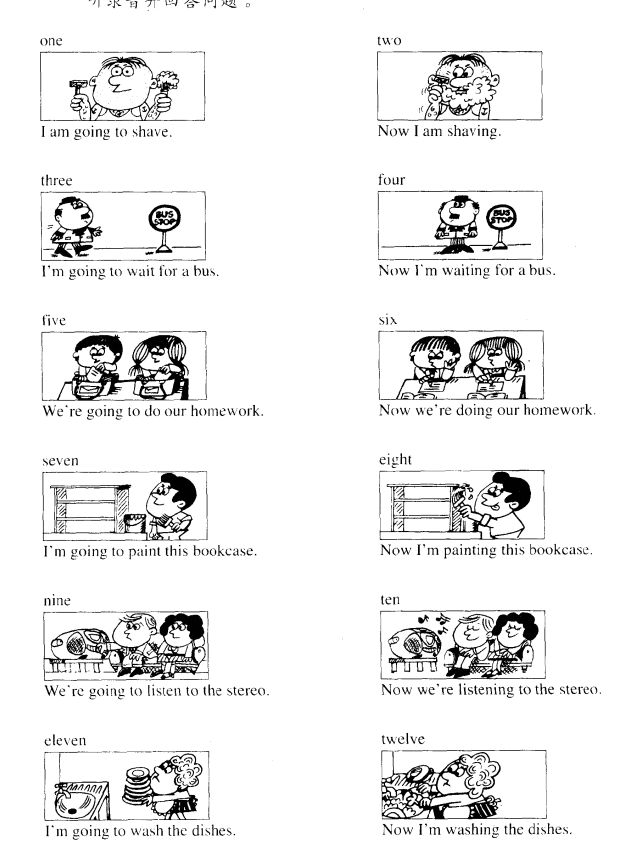

handbag n.  (女用) 手提包

Is this your ...?  这是你的 ... 吗？

**skirt** n. 裙子
shirt n. 衬衣

umbrella n.伞

cloakroom n. 衣帽间

suit n. 一套衣服 （套件）

Nice to meet you 很高兴见到你

What make is it? 它是什么牌子?

nationality n.国籍

engineer n.工程师

nurse n.护士

air hostess n.空中小姐

postman n. 邮递员

**hairdresser** n. 理发师

mechanic n. 机械师

homewife n.家庭妇女

milkman n.送牛奶的人

fat adj. 胖的

thin adj. 瘦的

**tall** adj. 高的

short adj. 矮的

drity adj.脏的

perhaps adv. 大概

whose is this  ...? 这是谁的 ...?
whose is that ...?那是谁的 ...?

blouse n. 女衬衫

tie n. 领带

upstairs adv. 往楼上

customs n. 海关

officer n. 官员

brown adj. 棕色的

tourist n. 旅游者

Are you ... ? 你是...?

tired adj. 累,疲乏

matter n. 事情

thirsty n. 渴的

sharp adj. 锋利的

small adj. 小的

blunt adj.钝的

tin n. 罐头

fork n.叉子 v.岔

spoon n. 勺子

shelf n. 架子，搁板

**stereo** n. 立体声

**cupboard** n. 食橱

**cigarette** n. 香烟

**magazine** n.杂志

**kitchen** n. 厨房

**refrigerator** n.冰箱

**electric** adj. 带电的

cooker n. 炉子，炊具

living room n. 客厅

**armchair** 扶手椅

**untidy** adj. 乱，不整齐

clothes n.衣服

**wardrobe** n. 大衣柜

**dust** v.弹掉灰尘

**sweep** v. 扫

***What must I do?*** 我应该做什么？

**sharpen** v.削尖

**put on** 穿上

**take off**脱掉

**turn on/off** 开关(灯)

grass n.草地

climb v. 攀爬

What's he/she/it doing 他/她/它正在做什么?

type v. 打字
letter n. 信
basket n.篮子
bone n.骨头

tooth teeth(复数) n.牙齿
cook v. 做饭
tap n.(水)龙头

shine v. 照耀
aeroplane n.飞机

shave v. 刮脸
wash v. 洗

village n. 村庄
valley n. 山谷

bookcase n.书架
hammer n. 锤子
paint v. 涂，上漆
favourite adj.最喜欢的
dish n.盘子

What are you going to do ? 你准备做什么?
What are you doing now ? 你现在正在做什么?

in front of 在...之前
vase n. 花瓶
do with 指对某件事或者人的处理
There we are. 就放在那里

cheese n.奶酪
soap n.肥皂
tobacco n.烟草

a piece of 一块，一张，一片，用在不可数名词前，表示数量
a loaf of  一个
a bar of 一条
a bottle of 一瓶
a pound of 一磅
half a pound of 半榜
a quarter of 四分之一
a tin of 一听

Is there a ... in/on that ...?
在那个...中/上 有一个 ...吗？
Is there any ... in/on that  ...?

kettle n. 水壶
teapot n. 茶壶
boil v. 沸腾
