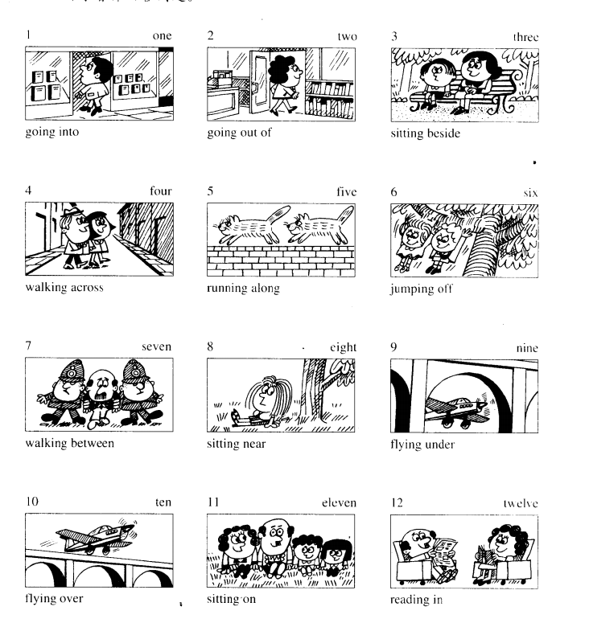
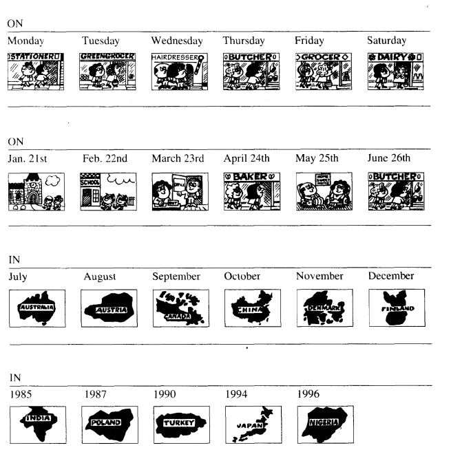

## 介词on in 在时间上的使用
* Don't forget to use...
    * in + month or year- In March, In 2003

    * on + date (with the year or without it) or day of the week- On April 2, On March 3, 1999, On Saturday

    * at + clock time, midnight, noon- At 3:30 p.m., At 4:01, At noon

* Remember also...

    * in + season- In the summer, In the winter

    * in + morning, afternoon, evening- In the morning, In the evening

    * at + night- At night

1. Let's meet __ 6:30.

2. The play is __ Saturday ___ noon.

3. I was born  ___ November 3, 1970.

4. Beverly went to Los Angeles ___ January.

5. Bill arrived in New York ___ February 7.

6. I love to see the flowers ___ the spring.

7. The movie starts ___ 7:30  ___ the evening.

8. We go to bed ___ 11:00 ___  night.

9. Her birthday is ___ October ___ the fall.

10. I saw a witch ___ midnight  ___ Saturday ___ October 31 ____ 1998.

answer:
> 1. at, 2. on/ at, 3. on, 4. in, 5. on, 6. in
> 2. at/ in, 8. at/ at 9. in/ in, 10. at/ on/ on/ in